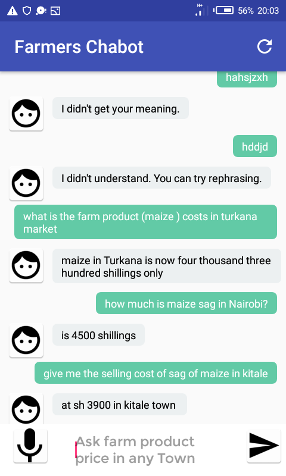
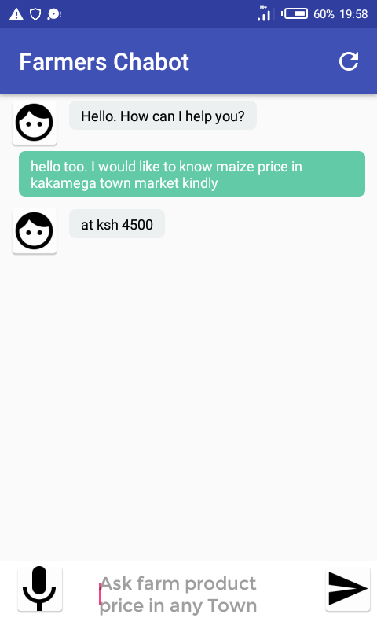

# A Farming Chatbot and Analysis Android App using IBM Watson

This is and android application that is used by farmers, citizens and business people in establishing the realtime prices of any farm product across any kenyan markets. also through this app the users can establish analytics of prices of farm products as well as the prediction of future(days, weeks, months and years) prices of such products thus it is a good/nice and helpful application.

                        
              

For **step-by-step instructions**, refer this tutorial - [Build an Android chatbot](https://cloud.ibm.com/docs/tutorials?topic=solution-tutorials-android-watson-chatbot)

The tutorial walks you through the process of defining intents and entities and building a dialog flow for your chatbot to respond to farmers queries. You will learn how to enable Speech to Text and Text to Speech services for easy interaction with the Android app.

incase you want to reach out to me here is my contact: 
email --  jobkimeli2016@gmail.com/ jkimeli@student.mmust.ac.ke/ kimelijob09@gmail.com/ 
phone --  +254 715375156/ +254 762641253

